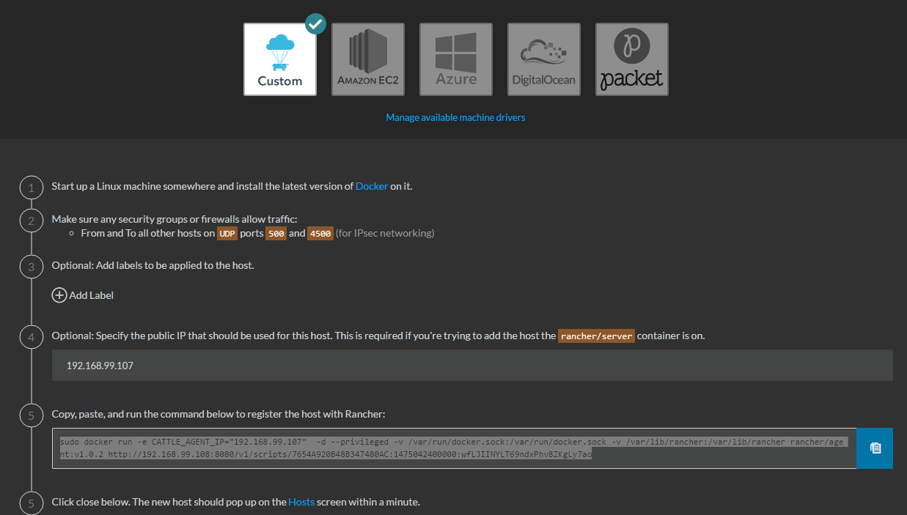

## Rancher Cluster 安裝筆記  ##
---

### Single Node Cluster mode ###

1. docker-toolbox install (ignore)

2. docker-machine start machine 裝一台 master rancher00, 三台 client
```shell
docker-machine create -d virtualbox --virtualbox-memory 2048 --virtualbox-boot2docker-url https://releases.rancher.co m/os/latest/rancheros.iso rancher00
docker-machine create -d virtualbox --virtualbox-memory 2048 --virtualbox-boot2docker-url https://releases.rancher.co m/os/latest/rancheros.iso rancher01
docker-machine create -d virtualbox --virtualbox-memory 2048 --virtualbox-boot2docker-url https://releases.rancher.co m/os/latest/rancheros.iso rancher02
docker-machine create -d virtualbox --virtualbox-memory 2048 --virtualbox-boot2docker-url https://releases.rancher.co m/os/latest/rancheros.iso rancher03
docker-machine ls
```

3. 使用 ssh terminal 連線進去 rancher os <br/>
key 存放的位置在 C:\Users\{username}\.docker\machine\machines\rancher00\id_rsa </br>
default user: docker , default password: 
整個設定的資料放在 config.json <br/>
rancherOS 和 boot2docker.iso 不一樣，使用 docker/tcuser 無法登入，一定要那把 id_rsa 的 key <br/>
當然，使用　docker-machine ssh rancher00 還是可以動

4. 啟動　rancher server (這邊使用 rancher00) 
```shell
docker run -d --restart=unless-stopped -p 8080:8080 rancher/server
docker ps 
```

5. 註冊 Host 到 Rancher server <br/>
連線到 rancher server http://192.168.99.108:8080 , 功能表 Infra > Host > Custom > 輸入資訊後，會得到類似這樣的 script 

```shell
sudo docker run -e CATTLE_AGENT_IP="192.168.99.107"  -d --privileged -v /var/run/docker.sock:/var/run/docker.sock -v /var/lib/rancher:/var/lib/rancher rancher/agent:v1.0.2 http://192.168.99.108:8080/v1/scripts/7654A920B48B347480AC:1475042400000:wfLJIINYLT69ndxPhv8ZKgLy7ao
```
ssh 進入 rancher01 執行這個命令，會將 Racher01  註冊進去 Racher server
<br/>
最終出來到 Infra > Host 可以看到這個畫面 <br/>
 <br/>
照以上動作，把幾台 VM 通通加進去做 Host，得到以下畫面<br/>


6. 接下來可以佈署一些簡單的 docker image 進去, 譬如 Weave Scope ，我很推薦的一套 docker base 監控程式<br/>
選擇 Catalog <br/>
<br/>
向下選到 Weave Scope > View Detail > Preview 看一下 Docker Compose, 可以學習一下 Docker compose 語法 <br/>
<br/>
直接跑 Launch ，可以啟動預設的 Service 和 container 數量，以這個 Case 來講，會在每個 Host 裝一個 Weave scope agent ，裝一個 Weave Scope server。Rancher 厲害的地方在於這些 container 的內部網路連結會自己幫你搞定，比 Docker link 來得好用很多。附圖是已經跑起來的樣子，我正在起另外一個 RabbitMQ 做下一個 Case <br/>
<br/>
可以點選 Host 看看實際上部署到哪些 Server 上 <br/>
<br/>


